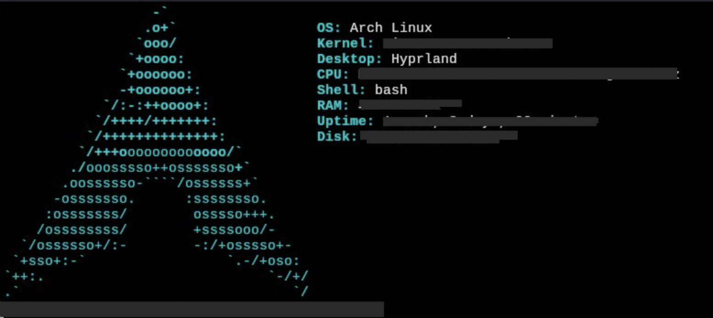

# Archinfo

Archinfo is a lightweight shell script that displays system information for Arch Linux in a clean and beautiful format. Partially inspired in LinuxDabbler's [debinfo](https://github.com/linuxdabbler/debinfo/tree/master). 

## Information Displayed

- OS: The operating system name.
- Kernel: The kernel version and release.
- Desktop: The current desktop environment.
- CPU: The CPU model.
- Shell: The default shell.
- RAM: The used and total RAM.
- Uptime: The system uptime.
- Disk: The used and total disk space, and the percentage of disk used.

## Usage

To use the script, simply run it in the terminal:

```bash
./archinfo
```
This will display the system information in the terminal.

In my computer, I moved the script to /usr/bin and gave it chmod +x permissions, then added it to ~/.bashrc so it opens every time I open a new terminal.


## Customization

You can customize the script to display different information by modifying the variables at the top of the script. For example, you can change the `Desktop` variable to display a different desktop environment, or you can add new variables to display additional information.